# דוח פרויקט מסדי נתונים - שלב א'
## Fair Play - מערכת אבטחה לאתר שחמט

**מגישים:**  
יובל כהן - ת"ז 316289412  
יאיר בן יצחק - ת"ז 217710656

---

## תוכן עניינים
1. [מבוא](#1-מבוא)
2. [מסכי המערכת](#2-מסכי-המערכת)
3. [תרשימי ERD ו-DSD](#3-תרשימי-erd-ו-dsd)
4. [מילון נתונים](#4-מילון-נתונים)
5. [החלטות עיצוב ונרמול](#5-החלטות-עיצוב-ונרמול)
6. [אכלוס נתונים](#6-אכלוס-נתונים)
7. [גיבוי ושחזור](#7-גיבוי-ושחזור)
8. [קבצי ההגשה](#8-קבצי-ההגשה)

---

## 1. מבוא
מערכת Fair Play מיועדת לניהול תהליכי אבטחה ואכיפה באתר שחמט: קבלת דיווחים משחקנים, פתיחת חקירות על חשד לרמאות או התנהגות לא תקינה, שמירת ראיות, הטלת חסימות וניהול ערעורים. מתוך המערכת הרחבה בחרנו להתמקד ביחידת המודרציה, כי היא כוללת כמה תהליכים ברורים שמתחברים טוב למסד נתונים: דיווח מוביל לחקירה, חקירה יכולה לכלול כמה ראיות, ובסופה ייתכן שתיפתח חסימה שעליה השחקן יכול לערער.

המידע המרכזי שנשמר במערכת:
- פרטי דיווחים על התנהגות חריגה במשחק.
- חקירות שמנוהלות על ידי אנשי צוות.
- ראיות שנאספות במהלך חקירה.
- חסימות וסיבות חסימה.
- ערעורים על חסימות.

הדגש בתכנון היה ליצור מבנה שאפשר להבין ממנו את תהליך העבודה של צוות המודרציה, ולא רק אוסף טבלאות מנותק. לכן שמרנו על קשרים ישירים בין שלבי הטיפול בדיווח.

---

## 2. מסכי המערכת
המסכים הראשונים נוצרו בעזרת Google AI Studio כדי להתחיל מהחוויה שהמשתמש רואה, ורק אחר כך לגזור ממנה את מבנה הנתונים.

קישור לפרויקט ב-AI Studio:  
[https://aistudio.google.com/apps/df11ef6b-b7e8-4fc1-b684-64313a11646c?showPreview=true&showAssistant=true](https://ai.studio/apps/df11ef6b-b7e8-4fc1-b684-64313a11646c)

**מסך הכניסה**  
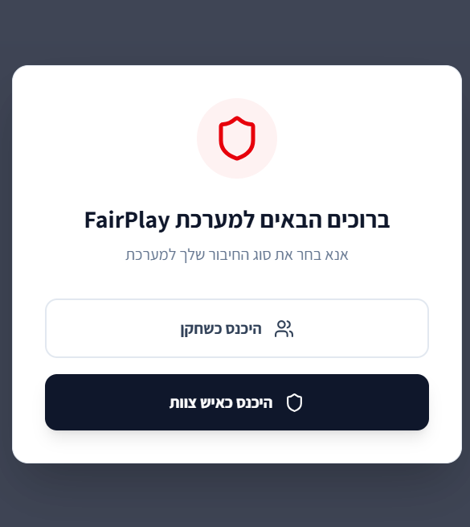

**מסך ניהול דיווחים**  
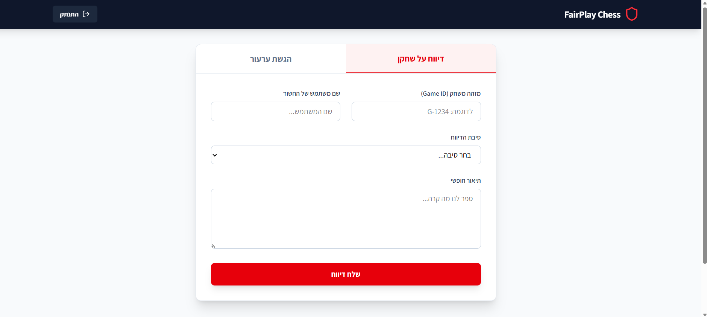

**מסך ניהול ערעורים**  
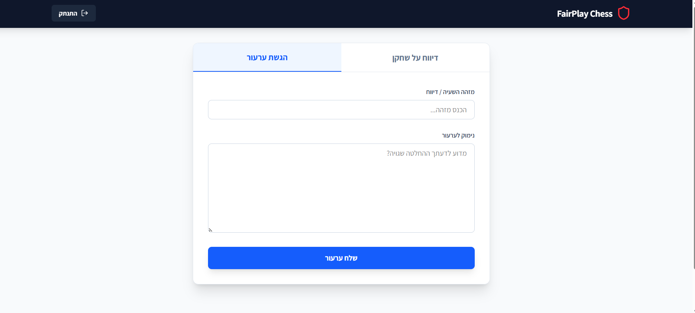

**מסך דשבורד מנהלים**  
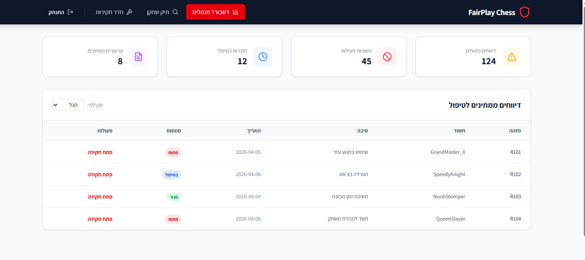

**מסך תיק שחקן**  
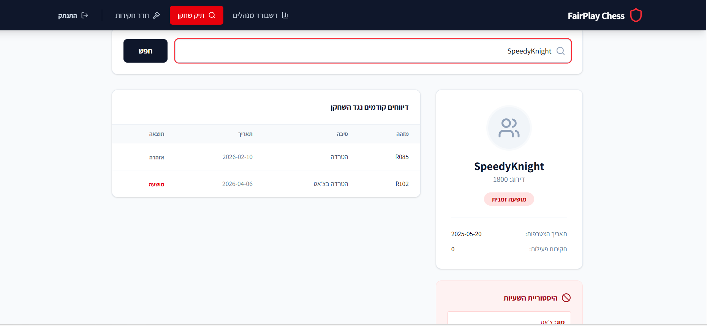

**מסך חדר חקירות**  
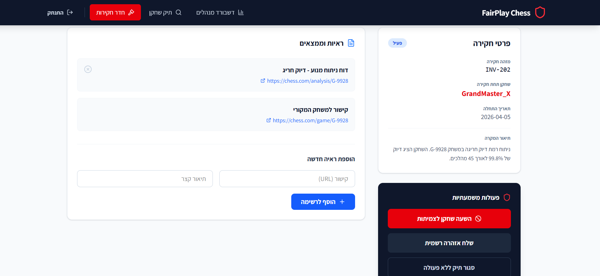

---

## 3. תרשימי ERD ו-DSD
לאחר אפיון המסכים בנינו את מבנה הנתונים ב-ERDPlus, ושמרנו את תרשימי ה-ERD וה-DSD בתיקיית התרשימים.

**ERD**  
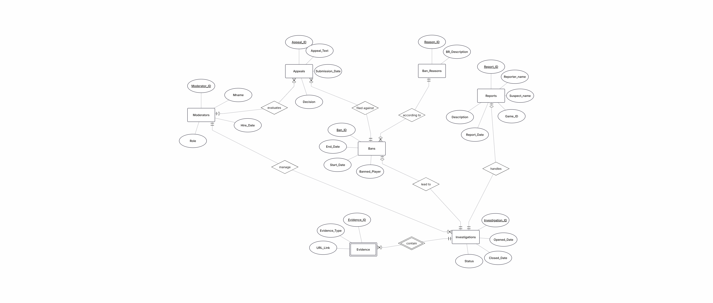

**DSD**  
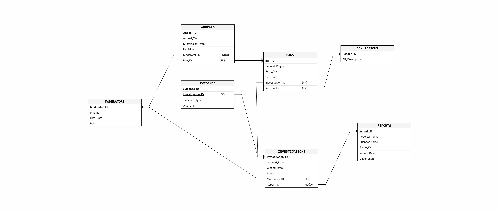

---

## 4. מילון נתונים
| טבלה | מטרה | שדות מרכזיים | קשרים |
|---|---|---|---|
| `MODERATORS` | שמירת אנשי הצוות שמטפלים בחקירות ובערעורים | `Moderator_ID`, `Mname`, `Hire_Date`, `Role` | מקושרת ל-`INVESTIGATIONS` ול-`APPEALS` |
| `REPORTS` | שמירת דיווחים שנפתחו על ידי שחקנים | `Report_ID`, `Reporter_name`, `Suspect_name`, `Game_ID`, `Report_Date`, `Description` | דיווח יכול להוביל לחקירה אחת |
| `INVESTIGATIONS` | ניהול חקירות שנפתחו בעקבות דיווחים | `Investigation_ID`, `Opened_Date`, `Closed_Date`, `Status`, `Moderator_ID`, `Report_ID` | מקושרת ל-`MODERATORS`, `REPORTS`, `EVIDENCE`, `BANS` |
| `EVIDENCE` | שמירת ראיות שנאספו במהלך חקירה | `Evidence_ID`, `Evidence_Type`, `URL_Link`, `Investigation_ID` | ישות חלשה שתלויה ב-`INVESTIGATIONS` |
| `BAN_REASONS` | רשימת סיבות חסימה אחידה | `Reason_ID`, `BR_Description` | מקושרת ל-`BANS` |
| `BANS` | תיעוד חסימות שהוטלו על שחקנים | `Ban_ID`, `Banned_Player`, `Start_Date`, `End_Date`, `Investigation_ID`, `Reason_ID` | מקושרת ל-`INVESTIGATIONS`, `BAN_REASONS`, `APPEALS` |
| `APPEALS` | ניהול ערעורים של שחקנים על חסימות | `Appeal_ID`, `Appeal_Text`, `Submission_Date`, `Decision`, `Moderator_ID`, `Ban_ID` | מקושרת ל-`BANS` ול-`MODERATORS` |

הטיפוסים המרכזיים שנבחרו הם `INT` למזהים ומספרים, `VARCHAR(size)` למחרוזות קצרות, `DATE` לתאריכים, ו-`TEXT` רק בשדות שבהם הטקסט יכול להיות ארוך במיוחד, כמו תוכן ערעור או קישור לראיה.

---

## 5. החלטות עיצוב ונרמול
בחרנו לבנות את המערכת סביב תהליך העבודה של צוות המודרציה: דיווח -> חקירה -> ראיות -> חסימה -> ערעור. המבנה הזה עזר לנו להחליט אילו קשרים חייבים להיות במסד הנתונים ואילו נתונים צריכים להישמר בנפרד.

החלטות מרכזיות:
- `EVIDENCE` הוגדרה כישות חלשה, כי ראיה אינה עומדת בפני עצמה בלי החקירה שאליה היא שייכת.
- `BAN_REASONS` הופרדה לטבלה משלה כדי למנוע כפילות בטקסטים של סיבות חסימה ולאפשר ניתוח עתידי של סיבות נפוצות.
- בטבלאות שבהן יש ערכים מוגבלים, כמו תפקיד איש צוות, סטטוס חקירה וסוג ראיה, נוספו אילוצי `CHECK`.
- בטבלאות עם תאריכי התחלה וסיום נוספו בדיקות שמונעות תאריך סיום מוקדם מתאריך התחלה.

בדיקת 3NF:
- לכל טבלה יש מפתח ראשי שמזהה רשומה בצורה חד-משמעית.
- שדות שאינם מפתח תלויים במפתח של הטבלה ולא במפתח חלקי.
- מידע שחוזר על עצמו, כמו סיבת חסימה, הופרד לטבלה נפרדת.
- לא נשמרים שדות מחושבים שאפשר לגזור מטבלאות אחרות.

לכן הסכמה עומדת לפחות ב-3NF עבור מבנה הנתונים הנוכחי.

---

## 6. אכלוס נתונים
מסד הנתונים אוכלס בשלוש שיטות שונות:

**1. סקריפט Python**  
נכתב סקריפט שמייצר 20,000 דיווחים ו-20,000 חקירות. הסקריפט נמצא כאן:  
[generate_data.py](./phaseA/Programing/generate_data.py)

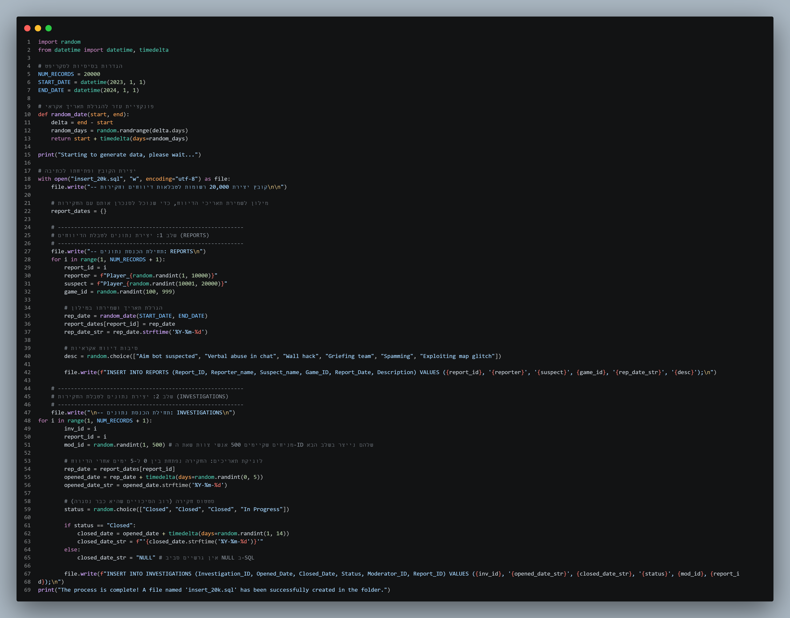

**2. Mockaroo**  
השתמשנו ב-Mockaroo ליצירת נתונים עבור אנשי צוות, חסימות, ערעורים וראיות.

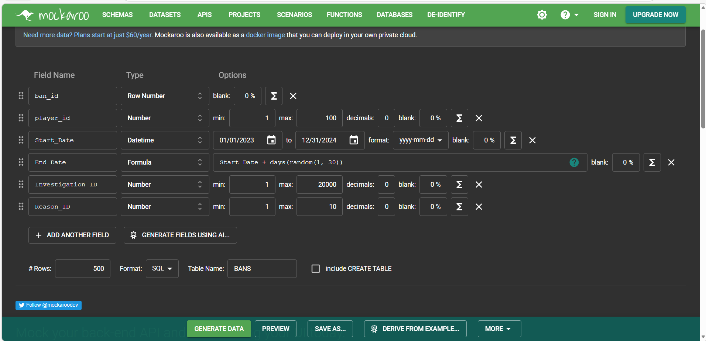

**3. קובץ Excel / ייבוא נתונים**  
נוצר קובץ Excel עם נתוני סיבות חסימה, ומתוכו נוצרו פקודות `INSERT`.

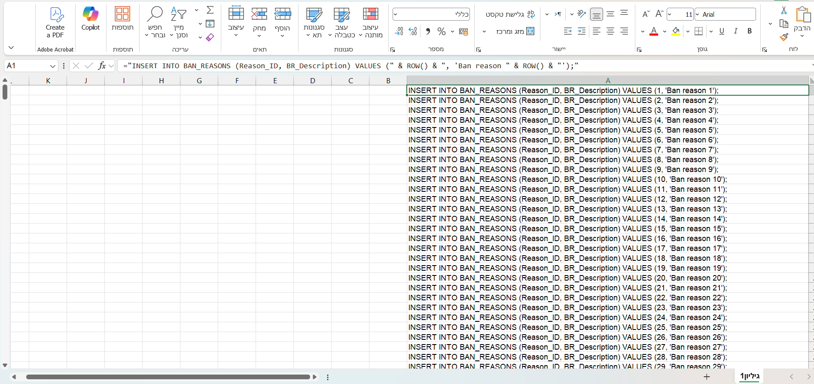

ספירת הרשומות בקובץ ההכנסה המרכזי:
| טבלה | מספר רשומות |
|---|---:|
| `REPORTS` | 20,000 |
| `INVESTIGATIONS` | 20,000 |
| `MODERATORS` | 500 |
| `BAN_REASONS` | 500 |
| `BANS` | 500 |
| `EVIDENCE` | 500 |
| `APPEALS` | 500 |

---

## 7. גיבוי ושחזור
בוצע גיבוי למסד הנתונים ונשמר קובץ גיבוי בתיקיית הגיבוי. בנוסף צורפו צילומי מסך של פעולות הגיבוי והשחזור.

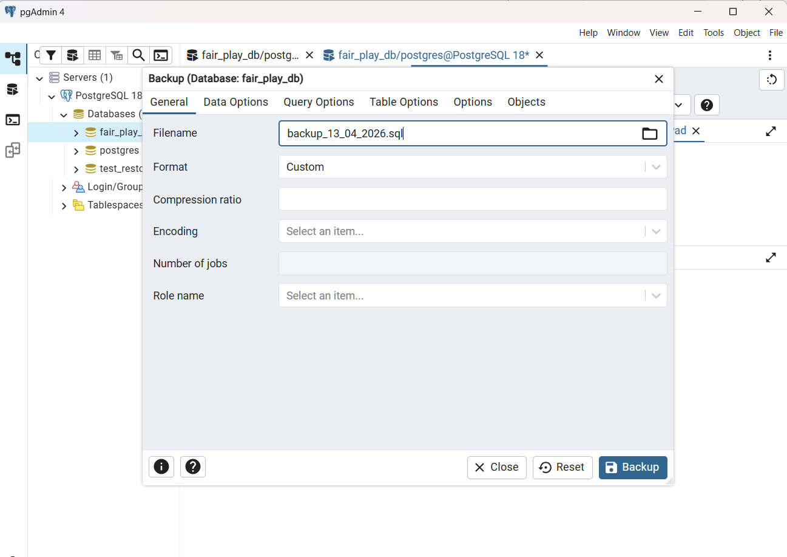
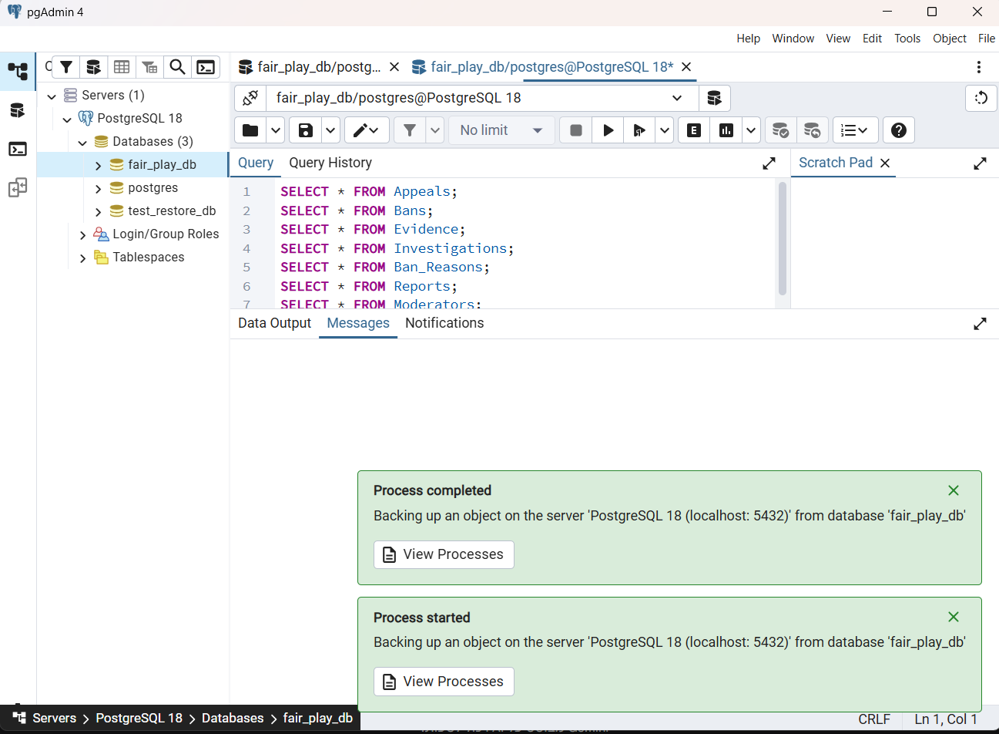

קובץ הגיבוי:  
[backup_13_04_2026.sql](./phaseA/Backup_Restore/backup_13_04_2026.sql)

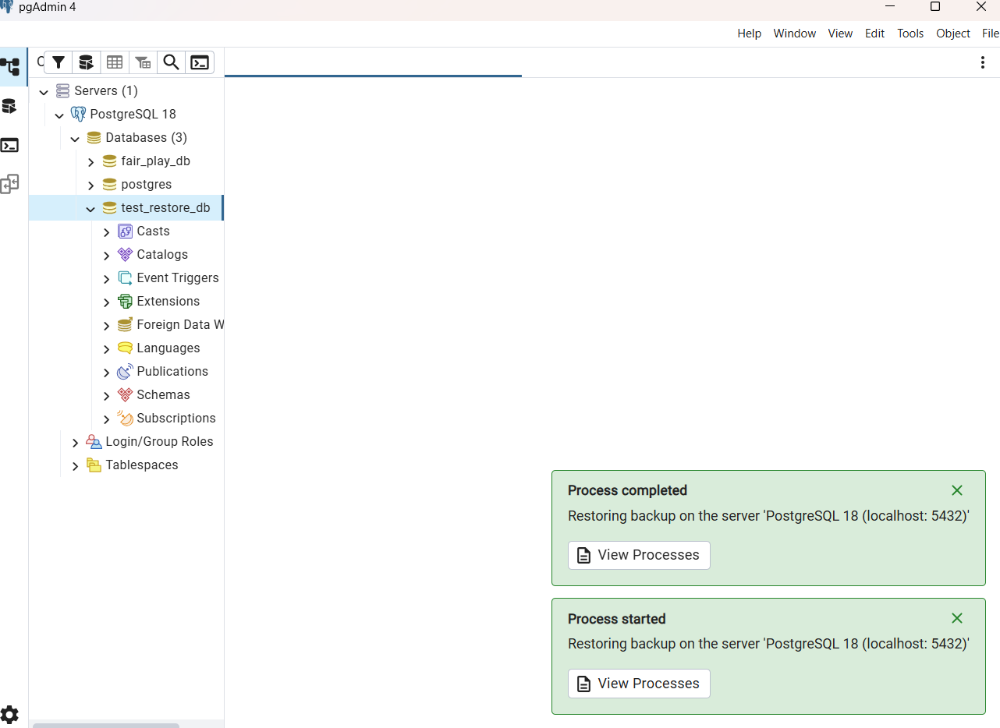

הערה: קובץ הגיבוי נשמר מפורמט `pg_dump` של PostgreSQL, ולכן הוא נראה כמו קובץ גיבוי של הכלי ולא כמו קובץ SQL רגיל שנכתב ידנית.

---

## 8. קבצי ההגשה
קבצי שלב א נמצאים בתיקיית [phaseA](./phaseA):
- [createTables.sql](./phaseA/sql_Files/createTables.sql)
- [dropTables.sql](./phaseA/sql_Files/dropTables.sql)
- [insertTables.sql](./phaseA/sql_Files/insertTables.sql)
- [selectAll.sql](./phaseA/sql_Files/selectAll.sql)
- [תיקיית מסכי UI](./phaseA/UI_Files)
- [תיקיית תרשימים](./phaseA/Diagrams)
- [תיקיית גיבוי ושחזור](./phaseA/Backup_Restore)
- [תיקיית קבצי Mockaroo](./phaseA/mockarooFiles)
- [תיקיית קוד ליצירת נתונים](./phaseA/Programing)
- [תיקיית קבצי ייבוא](./phaseA/DataImportFiles)

נוצר TAG בגיט עבור שלב א בשם `Stage-A`.
