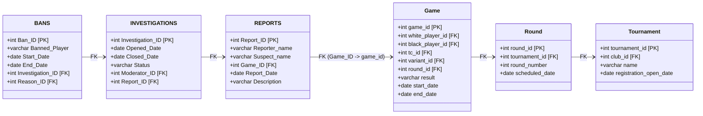

# דוח הפרויקט - שלב ג' (אינטגרציה ומבטים)

## 1. תרשימי DSD ו-ERD
*כאן עליכם להדביק את תמונות המסך שיצרתם ב-ERDPlus*
* **DSD של האגף החדש (שחמט):** 


* **ERD של האגף החדש (שחמט):** 


* **ERD משותף (לאחר האינטגרציה):** 


* **DSD לאחר אינטגרציה:** 


## 2. אלגוריתם הינדוס לאחור (Reverse Engineering)
תהליך הפיכת ה-DSD ל-ERD בוצע לפי השלבים הבאים:
1. **ישויות:** כל טבלה ב-DSD של השחמט (כמו `Tournament`, `Registration`, `Round`, `TimeControl`, `GameVariant`, `Game`) הומרה לישות ב-ERD. טבלאות עזר (כמו Player ו-Club) לא נכללו במיפוי הישויות המרכזי של שלב א'.
2. **תכונות ומפתחות ראשיים:** עמודות הטבלאות הפכו לתכונות של הישויות. המפתח הראשי של כל טבלה (לדוגמה `game_id`) סומן כמאפיין מפתח עם קו תחתון.
3. **קשרים (Relationships):** מפתחות זרים (Foreign Keys) זוהו ב-DSD והומרו לקשרים בין הישויות. לדוגמה, המפתח הזר `tc_id` בטבלת `Game` יצר קשר של 1:N בין `TimeControl` ל-`Game`. 

## 3. החלטות בשלב האינטגרציה
בחרנו לשלב את מערכת המודרציה (FairPlay) שלנו עם מערכת השחמט על ידי חיבור ישיר של הדיווחים למשחקים עצמם.
1. **קישור בין דיווח למשחק (Game_ID):** זיהינו שטבלת `REPORTS` במערכת שלנו דורשת שיוך למשחק בו התרחשה הרמאות או ההפרה. הגדרנו את עמודת `Game_ID` כ-Foreign Key המצביע על הישות `Game` ממערכת השחמט.
2. החלטה זו מאפשרת למערכת לדעת את כל פרטי המשחק (זמן, סוג המשחק וכו') בעת הטיפול בדיווח.
3. לא ביצענו יצירה מחדש של הטבלאות, אלא השתמשנו בפקודות `ALTER TABLE` כדי לאכוף את הקשר ולעדכן את הנתונים הקיימים (פירוט בפסקה הבאה).

## 4. הסבר מילולי של התהליך והפקודות
בכדי לבצע את האינטגרציה במסד הנתונים:
1. עדכנו את ערכי ה-`Game_ID` בטבלת `REPORTS` הקיימת כך שיצביעו לרשומת משחק חוקית (על ידי לקיחת ה-`game_id` הקיים בטבלת המשחקים), וזאת על מנת לא להפר את חוקי ה-Constraint שניצור.
2. הרצנו פקודת `ALTER TABLE REPORTS ADD CONSTRAINT...` כדי להפוך את ה-`Game_ID` למפתח זר המקושר ל-`Game(game_id)`.

## 5. מבטים (Views)
### מבט 1: Suspicious_Games_View
* **תיאור מילולי:** מבט מנקודת המבט של הנהלת משחקי השחמט. הוא מאגד את נתוני המשחקים (זמנים, סוגים) ומראה כמה דיווחים התקבלו על כל משחק.
* **קוד שרץ (לדוגמה):** `SELECT * FROM Suspicious_Games_View LIMIT 10;`
* **פלט:** `[יש להדביק כאן את הפלט של השאילתה - תמונת מסך או טבלה]`

**שאילתות על המבט:**
1. **מציאת משחקים עם יותר מדיווח אחד:**
   * קוד: 
     ```sql
     SELECT * FROM Suspicious_Games_View WHERE Total_Reports > 1 ORDER BY Total_Reports DESC;
     ```
   * פלט: `[הדבק פלט כאן]`
2. **מציאת משחקים חשודים מסוג בליץ:**
   * קוד: 
     ```sql
     SELECT * FROM Suspicious_Games_View WHERE Time_Control = 'Blitz' ORDER BY start_date DESC;
     ```
   * פלט: `[הדבק פלט כאן]`

### מבט 2: Moderation_Queue_View
* **תיאור מילולי:** מבט מנקודת המבט של מערכת המודרציה שלנו. המבט מציג למודרטורים את רשימת החקירות הפעילות ומחבר אליהן את סיבת הדיווח ואת פרטי משחק השחמט הרלוונטי.
* **קוד שרץ (לדוגמה):** `SELECT * FROM Moderation_Queue_View LIMIT 10;`
* **פלט:** `[יש להדביק כאן את הפלט של השאילתה - תמונת מסך או טבלה]`

**שאילתות על המבט:**
1. **הצגת כל החקירות הפתוחות כרגע:**
   * קוד: 
     ```sql
     SELECT * FROM Moderation_Queue_View WHERE Status = 'In Progress' ORDER BY Opened_Date;
     ```
   * פלט: `[הדבק פלט כאן]`
2. **בדיקת עומס על כל מודרטור:**
   * קוד: 
     ```sql
     SELECT Moderator_Name, COUNT(Investigation_ID) as Active_Investigations, MIN(Game_Date) as Oldest_Game FROM Moderation_Queue_View WHERE Status = 'In Progress' GROUP BY Moderator_Name;
     ```
   * פלט: `[הדבק פלט כאן]`
