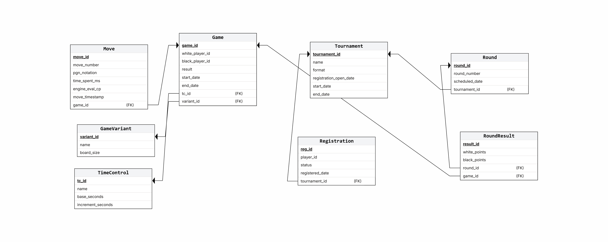
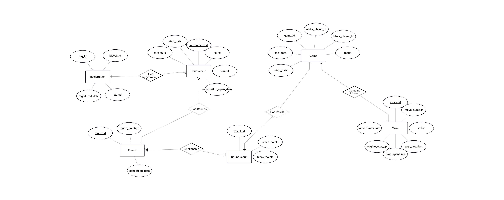
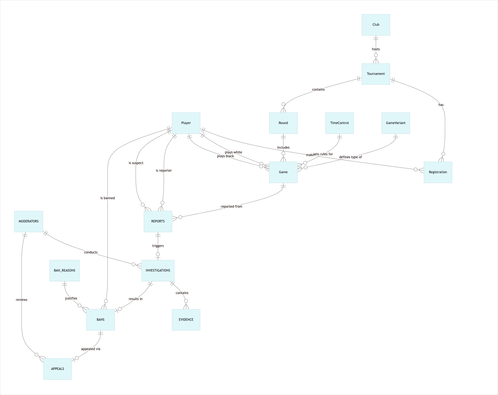
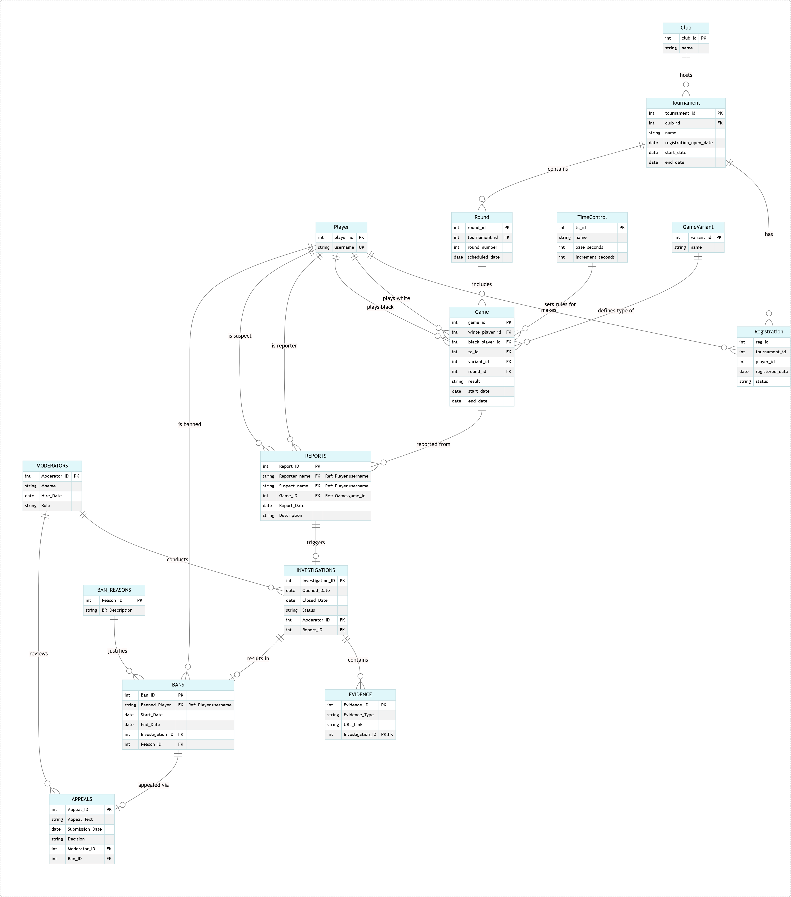
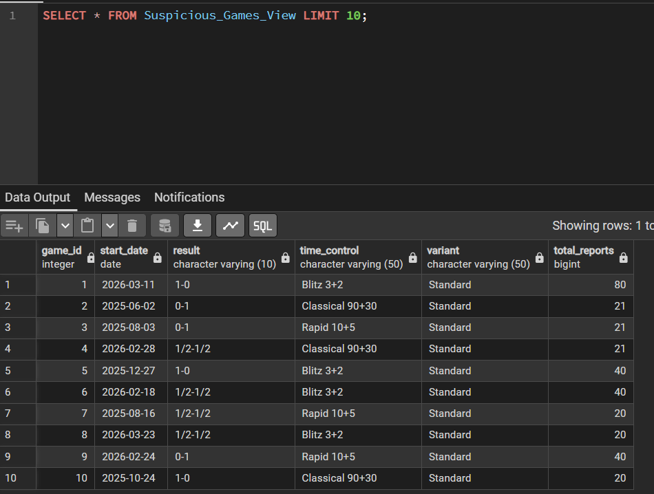
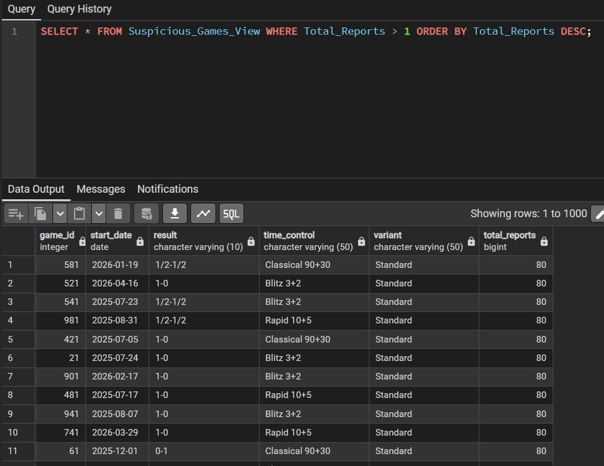
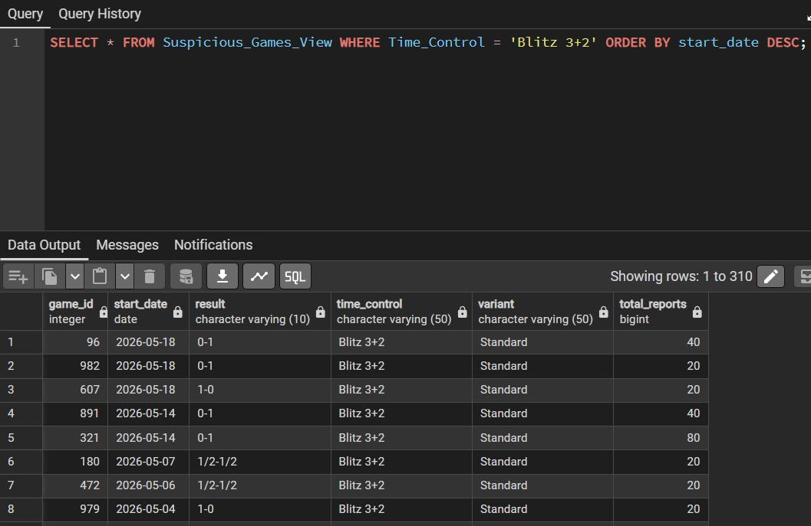
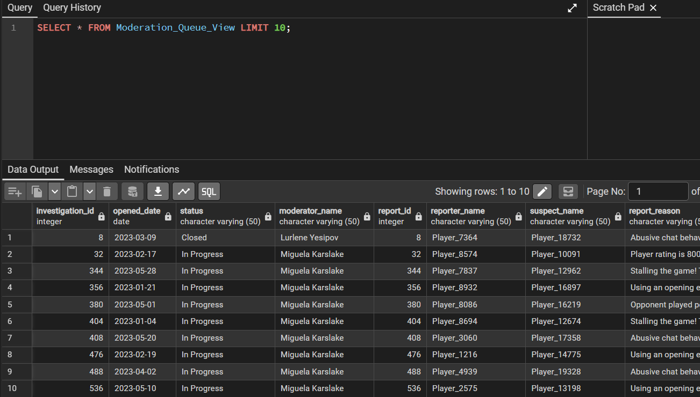
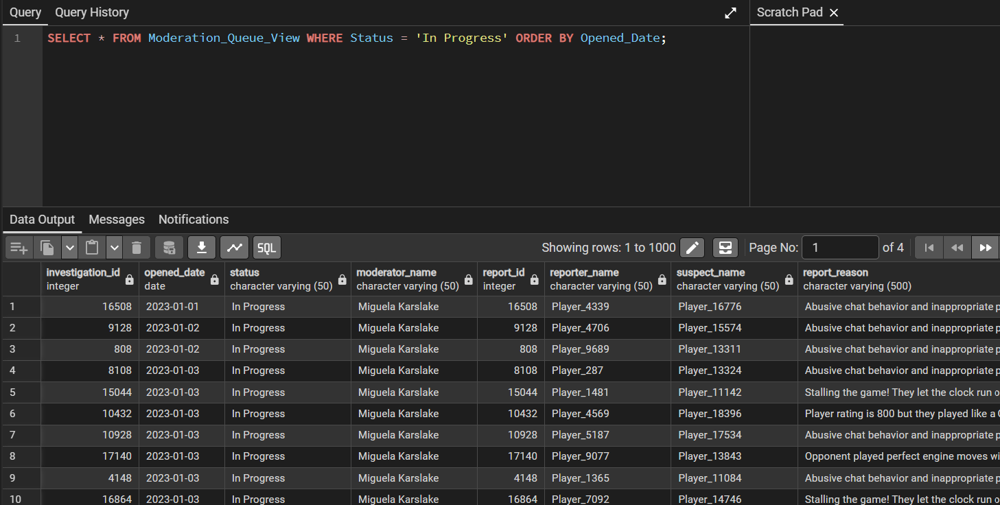
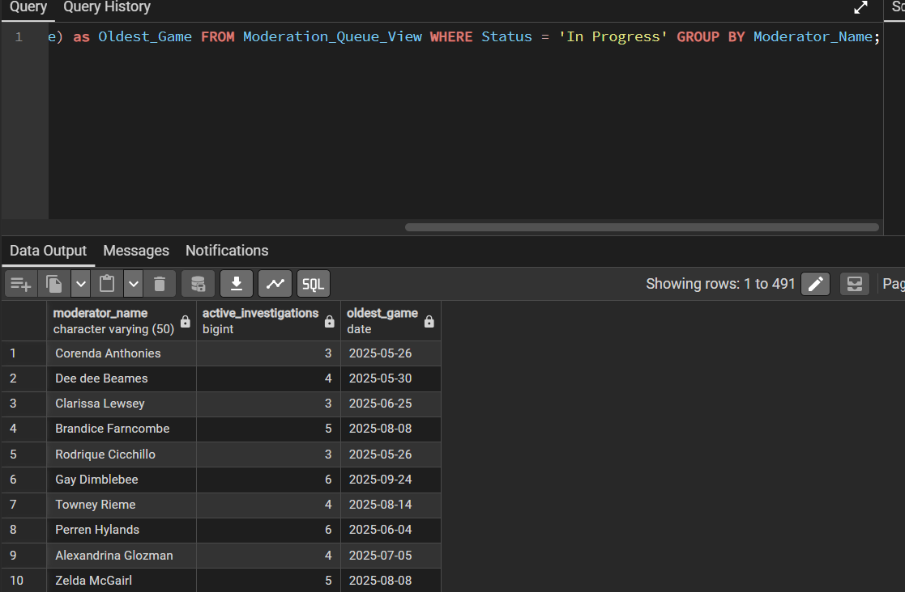

# דוח הפרויקט - שלב ג' (אינטגרציה ומבטים)

## 1. תרשימי DSD ו-ERD
* **DSD של האגף החדש (שחמט):** 


* **ERD של האגף החדש (שחמט):** 


* **ERD משותף (לאחר האינטגרציה):** 


* **DSD לאחר אינטגרציה:** 


## 2. אלגוריתם הינדוס לאחור (Reverse Engineering)
תהליך הפיכת ה-DSD ל-ERD בוצע לפי השלבים הבאים:
1. **ישויות:** כל טבלה ב-DSD של השחמט (כמו `Tournament`, `Registration`, `Round`, `TimeControl`, `GameVariant`, `Game`) הומרה לישות ב-ERD. טבלאות עזר (כמו Player ו-Club) לא נכללו במיפוי הישויות המרכזי של שלב א'.
2. **תכונות ומפתחות ראשיים:** עמודות הטבלאות הפכו לתכונות של הישויות. המפתח הראשי של כל טבלה (לדוגמה `game_id`) סומן כמאפיין מפתח עם קו תחתון.
3. **קשרים (Relationships):** מפתחות זרים (Foreign Keys) זוהו ב-DSD והומרו לקשרים בין הישויות. לדוגמה, המפתח הזר `tc_id` בטבלת `Game` יצר קשר של 1:N בין `TimeControl` ל-`Game`. 

## 3. החלטות בשלב האינטגרציה
בחרנו לשלב את מערכת המודרציה (FairPlay) שלנו עם מערכת השחמט על ידי חיבור ישיר של הדיווחים למשחקים עצמם, וכן חיבור השחקנים (המדווחים והמורחקים) לטבלת השחקנים הראשית.
1. **קישור בין דיווח למשחק (Game_ID):** זיהינו שטבלת `REPORTS` במערכת שלנו דורשת שיוך למשחק בו התרחשה הרמאות או ההפרה. הגדרנו את עמודת `Game_ID` כ-Foreign Key המצביע על הישות `Game` ממערכת השחמט.
2. **קישור בין מדווחים וחשודים לשחקנים קיימים:** הגדרנו את השדות `Reporter_name`, `Suspect_name` ו-`Banned_Player` כמפתחות זרים המצביעים לטבלת `Player(username)` במערכת השחמט כדי להבטיח אחידות נתונים בין המערכות.
3. החלטות אלו מאפשרות למערכת לדעת את כל פרטי המשחק (זמן, סוג המשחק וכו') ופרטי השחקנים באופן שלם בעת הטיפול בדיווח או הרחקה.
4. לא ביצענו יצירה מחדש של הטבלאות, אלא השתמשנו בפקודות `ALTER TABLE` כדי לאכוף את הקשרים ולעדכן את הנתונים הקיימים בבטחה.

## 4. הסבר מילולי של התהליך והפקודות
בכדי לבצע את האינטגרציה במסד הנתונים, פעלנו בשלבים הבאים (כפי שמתואר בקובץ Integrate.sql):
1. **הוספת נתוני דמו בסיסיים** לטבלאות השחמט (`Player`, `Game`) כדי למנוע שגיאות Constraint בעת העדכון הראשוני.
2. **עדכון ערכי ה-Game_ID** בטבלת `REPORTS` הקיימת כך שיצביעו לרשומת משחק חוקית, והפעלת פקודת `ALTER TABLE REPORTS ADD CONSTRAINT` להגדרת המפתח הזר ל-`Game(game_id)`.
3. **אכלוס טבלת השחקנים (Player)** מתוך כלל השמות המופיעים כעת במערכת האכיפה (שילוב ב-UNION של מדווחים, חשודים ושחקנים מורחקים), כדי להבטיח שכל שחקן קיים בטבלה.
4. הוספת אילוץ `UNIQUE` על עמודת ה-username בטבלת השחקנים.
5. הפעלת שלוש פקודות `ALTER TABLE` על טבלאות `REPORTS` ו-`BANS` כדי לקשר אותן למפתחות הזרים לשחקנים (`Player.username`).
6. **הרצת שאילתות השלב הקודם:** לאחר סיום בניית מסד הנתונים המשולב, הרצנו מחדש את השאילתות משלב ב' (Queries.sql) ווידאנו שהן עדיין עובדות כנדרש ללא תקלות, מאחר והמבנה הלוגי נשמר.

## 5. מבטים (Views)
### מבט 1: Suspicious_Games_View
* **תיאור מילולי:** מבט מנקודת המבט של הנהלת משחקי השחמט. הוא מאגד את נתוני המשחקים (זמנים, סוגים) ומראה כמה דיווחים התקבלו על כל משחק.
* **קוד שרץ (לדוגמה):** `SELECT * FROM Suspicious_Games_View LIMIT 10;`
* **פלט:** 

**שאילתות על המבט:**
1. **מציאת משחקים עם יותר מדיווח אחד:**
   * קוד: 
     ```sql
     SELECT * FROM Suspicious_Games_View WHERE Total_Reports > 1 ORDER BY Total_Reports DESC;
     ```
   * פלט: 
2. **מציאת משחקים חשודים מסוג בליץ:**
   * קוד: 
     ```sql
     SELECT * FROM Suspicious_Games_View WHERE Time_Control = 'Blitz' ORDER BY start_date DESC;
     ```
   * פלט: 

### מבט 2: Moderation_Queue_View
* **תיאור מילולי:** מבט מנקודת המבט של מערכת המודרציה שלנו. המבט מציג למודרטורים את רשימת החקירות הפעילות ומחבר אליהן את סיבת הדיווח ואת פרטי משחק השחמט הרלוונטי.
* **קוד שרץ (לדוגמה):** `SELECT * FROM Moderation_Queue_View LIMIT 10;`
* **פלט:** 

**שאילתות על המבט:**
1. **הצגת כל החקירות הפתוחות כרגע:**
   * קוד: 
     ```sql
     SELECT * FROM Moderation_Queue_View WHERE Status = 'In Progress' ORDER BY Opened_Date;
     ```
   * פלט: 
2. **בדיקת עומס על כל מודרטור:**
   * קוד: 
     ```sql
     SELECT Moderator_Name, COUNT(Investigation_ID) as Active_Investigations, MIN(Game_Date) as Oldest_Game FROM Moderation_Queue_View WHERE Status = 'In Progress' GROUP BY Moderator_Name;
     ```
   * פלט: 
