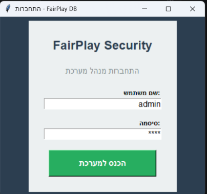
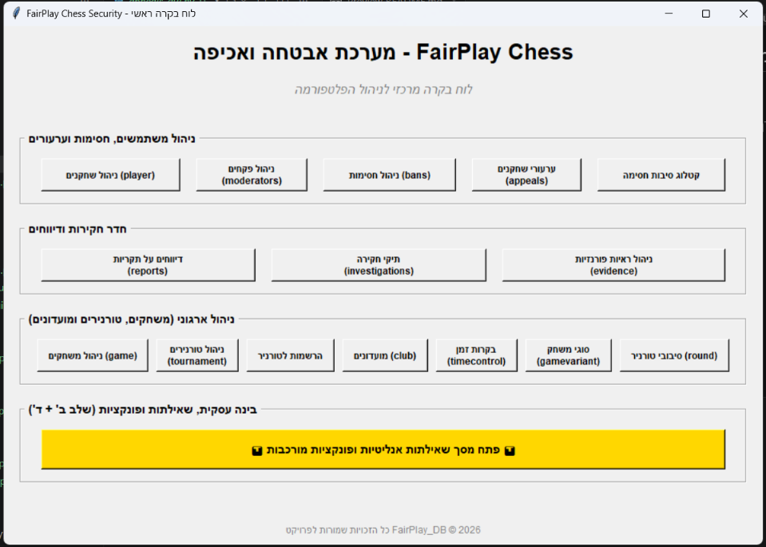
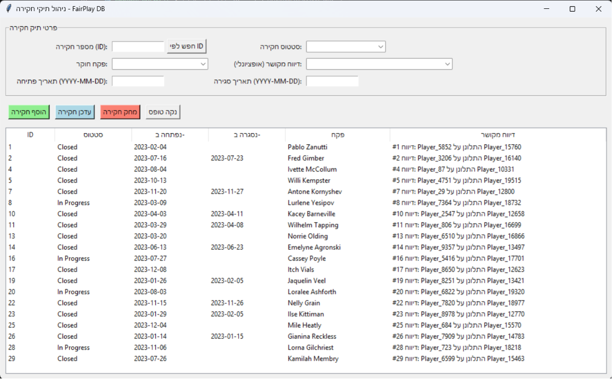
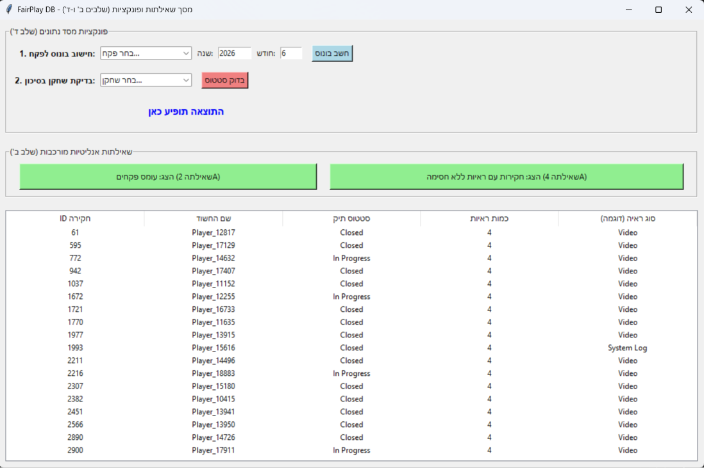
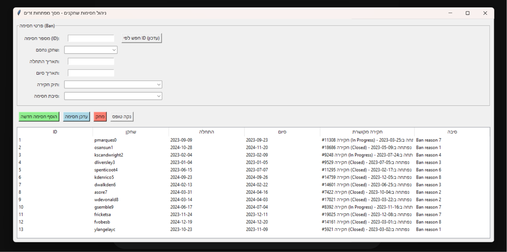
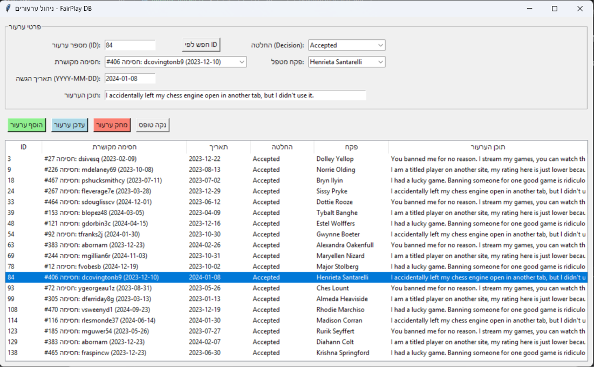
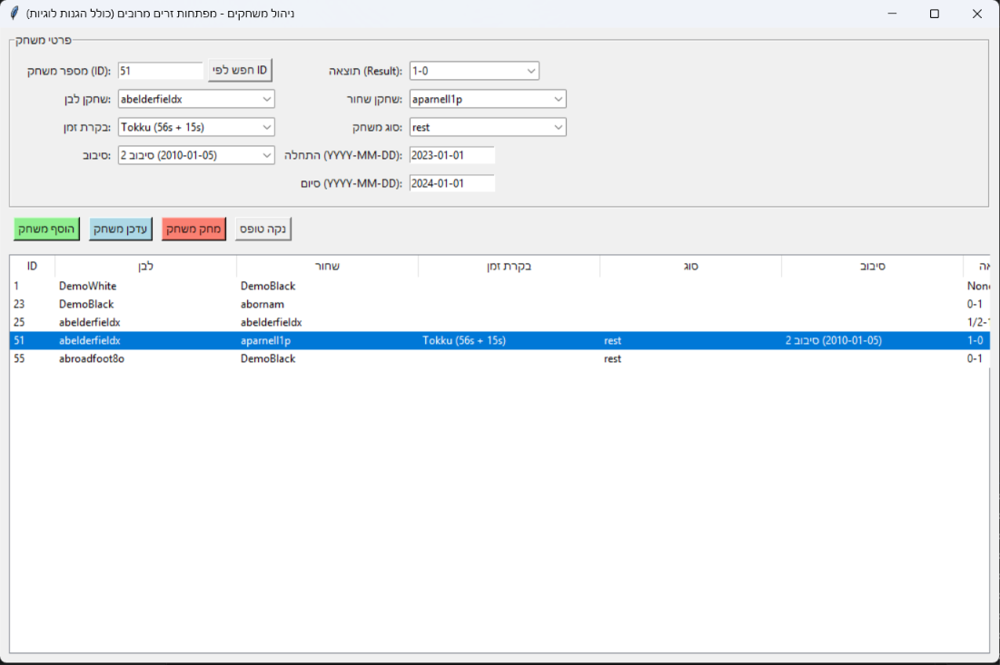

# פרויקט מסד נתונים - FairPlay Chess Security (שלב ה')

## הקדמה ותיאור המערכת
אפליקציית FairPlay נוצרה כמעטפת ניהול (Admin Dashboard) כוללת למערכת אבטחה ואכיפה בפלטפורמת שחמט מקוונת. המערכת מספקת למנהלים ולפקחים (Moderators) גישה מלאה וידידותית למסד הנתונים לבצוע פעולות CRUD על כלל הטבלאות, תוך שמירה על אמינות הנתונים ואכיפת חוקים עסקיים מתקדמים.

## מבנה המערכת וחלוקה פנימית
לוח הבקרה הראשי מחולק לארבעה מודולים מרכזיים, המאגדים בתוכם את 15 מסכי המערכת:

* **ניהול משתמשים ואכיפה:** אזור המוקדש לניהול השוטף של הפלטפורמה. כולל שליפה ועדכון של פרטי שחקנים, ניהול הרשאות פקחים, הפעלת חסימות (Bans), ניהול ערעורי שחקנים וקידוד סיבות חסימה.
* **חדר חקירות ודיווחים:** הלב של מערכת האכיפה. מאפשר קבלת דיווחים משחקנים, פתיחה וניהול של תיקי חקירה (Investigations), וקישור ישיר של ראיות פורנזיות (צילומי מסך, לוגים וכו') לכל חקירה.
* **ניהול ארגוני (משחקים וטורנירים):** ניהול התשתית התחרותית של הפלטפורמה. כולל מעקב אחר משחקים בודדים, הקמת מועדונים, תזמון טורנירים מרובי-סיבובים, ניהול הרשמות שחקנים, והגדרת בקרות זמן וסוגי משחק.
* **בינה עסקית, שאילתות ופונקציות:** מסך אנליטי מתקדם המציג תובנות מורכבות ממסד הנתונים (שלבים ב' ו-ד'). כולל חישובי עומס עבודה של פקחים, איתור חקירות מחשידות, הרצת פונקציות PL/pgSQL לבדיקת סיכון שחקנים וחישוב בונוסים.

## הוראות התחברות והפעלה
1. ודאו כי קונטיינר ה-PostgreSQL של הפרויקט פועל ברקע על הפורט הסטנדרטי (5432).
2. פתחו את תיקיית קוד המקור ("שלב ה") בסביבת הפיתוח או בטרמינל.
3. ודאו שהספרייה `psycopg2` מותקנת בסביבת הפייתון שלכם (`pip install psycopg2`).
4. הפעילו את האפליקציה דרך קובץ מסך הכניסה הראשי: `python login_gui.py`
5. **פרטי גישה למערכת:**
   - **שם משתמש:** admin
   - **סיסמה:** 1234
6. לאחר אימות מוצלח, ייפתח לוח הבקרה הראשי (`main.py`) וממנו ניתן לנווט בצורה חלקה לכל מסכי ה-CRUD במערכת.

## טכנולוגיות ויישום דרישות הפרויקט
הממשק הגרפי נכתב ב-Python ומשתמש בספריית **Tkinter** לתצוגה ו-**psycopg2** לתקשורת מול מסד הנתונים.
* **פעולות CRUD:** כל טבלה זכתה למסך ייעודי הכולל טופס, כפתורי פעולה, וטבלת תצוגה חיה. כפתור "חפש לפי ID" מבצע שליפה מלאה של הנתונים אל תוך הטופס לצורך עדכון קל ומהיר.
* **הסתרת מפתחות זרים:** יישמנו מנגנון תרגום חכם בשכבת הפייתון. מפתחות זרים מומרים באופן שקוף לטקסט קריא (למשל: תצוגת שמות שחקנים, תאריכים ושמות מועדונים) בתוך תפריטים נפתחים (Combobox) ובטבלאות התצוגה.
* **שכבת הגנה (Validation):** הוספנו לוגיקה מתקדמת המונעת מצבים לא חוקיים לפני הפנייה לדאטה-בייס (למשל: חסימת הגשת ערעור לפני תאריך החסימה, או מניעת הרשמה לטורניר מחוץ למועדים המוגדרים).
* **ארכיטקטורת חלונות:** כדי להבטיח יציבות, הניווט מלוח הבקרה פותח כל מסך תחת `subprocess` נפרד לחלוטין.

## צילומי מסך
להלן צילומי מסך המדגימים את פעילות המערכת, התפריטים ומסכי הניהול השונים, כולל הדגמה של משיכת הנתונים, שכבות ההגנה והסתרת מפתחות זרים:

### 1. מסך הכניסה למערכת (Login)
מאפשר גישה מאובטחת ומבוקרת למנהלי המערכת בלבד.

---

### 2. לוח הבקרה הראשי (Main Dashboard)
המסך המרכזי המאגד את כל 15 מסכי ה-CRUD ומסך הלוגיקה, מחולקים לקטגוריות נושאיות לנוחות עבודה מקסימלית.

---

### 3. חדר חקירות (Investigations CRUD)
דוגמה למסך ניהול נתונים. ניתן לראות כיצד מפתחות זרים מומרים לטקסט קריא וידידותי למשתמש, יחד עם הגנות על תאריכי פתיחה וסגירה למניעת מצבים לא חוקיים.

---

### 4. בינה עסקית ושאילתות (שלבים ב' ו-ד')
מסך המריץ שאילתות אנליטיות מורכבות ופונקציות מתקדמות (PL/pgSQL) ישירות מתוך מסד הנתונים בזמן אמת, ומציג את הפלטים בטבלאות ייעודיות.

---

### 5. ניהול חסימות שחקנים (Player Bans CRUD)
ממשק להטלת חסימות על שחקנים תוך קישור חכם לסיבות החסימה ולתיק החקירה הרלוונטי, תוך הסתרה מוחלטת של מפתחות ה-ID השרירותיים מהמשתמש.

---

### 6. ניהול ערעורים (Appeals CRUD)
מערכת לטיפול בערעורי שחקנים על עונשי חסימה, הכוללת שכבת הגנה (Validation) בפייתון המונעת הזנת תאריך ערעור שקודם לתאריך החסימה עצמו.

---

### 7. ניהול משחקים (Games CRUD)
מסך מורכב המנהל את היסטוריית המשחקים, תוך המרת חמישה מפתחות זרים שונים לשמות קריאים (שחקנים, סיבובים, בקרות זמן וסוגים) והפעלת הגנה המונעת משחקן לבצע מהלך נגד עצמו.
